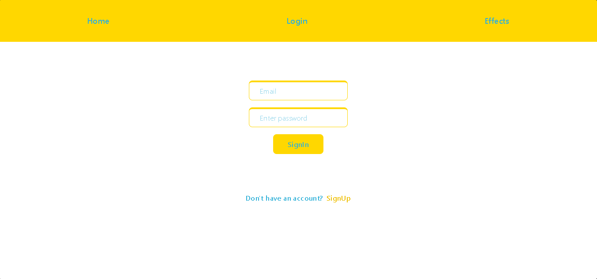
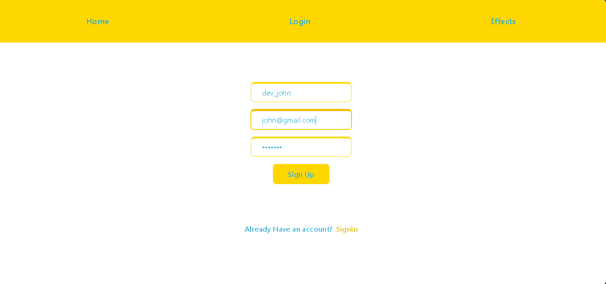
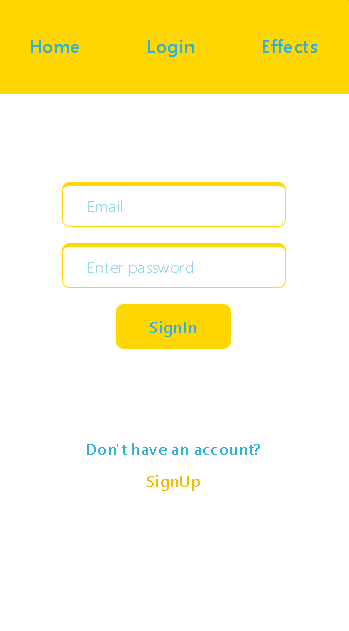
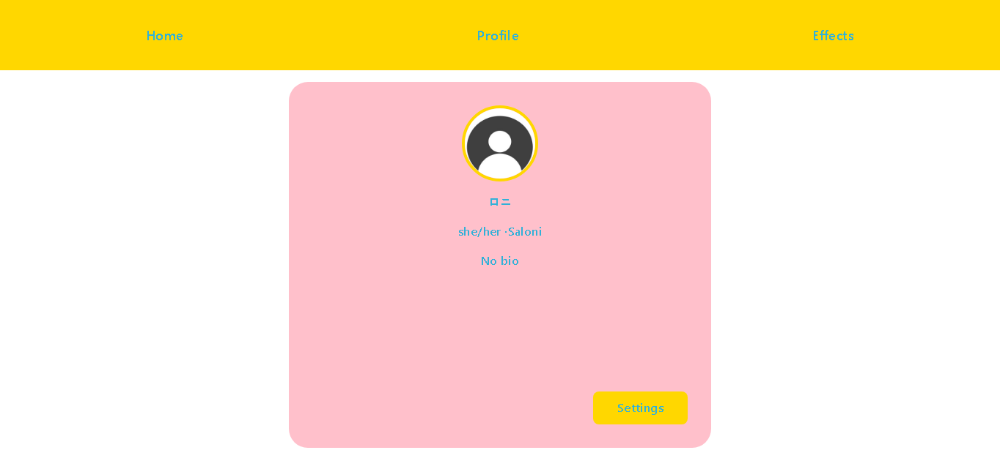
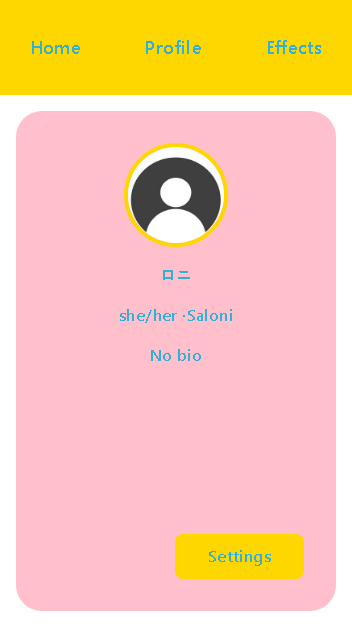
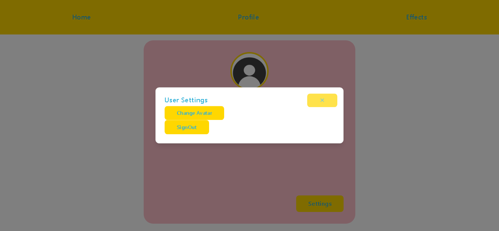

# miniNitro

miniNitro is a full-stack MERN application inspired by Discord Nitro profile enhancements.  
The goal of this project is to explore customizable user profiles, premium-style visual effects, and feature-gated profile enhancements in a scalable full-stack architecture.

This project is currently in active development.

---

## Vision

miniNitro aims to replicate and reimagine premium-style profile customization features such as animated profile effects, badges, and enhanced visual identity systems.

Rather than just recreating UI effects, this project focuses on building a structured, full-stack foundation that supports:

- User authentication
- Persistent profile data
- Feature-gated enhancements
- Expandable profile customization system

---

## Screenshots

### Auth Pages




### Onboarding Form


### Profile Card



### User Settings



## Tech Stack

**Frontend**
- React (Vite)
- React Router
- Tailwind CSS
- shadcn/ui

**Backend**
- Node.js
- Express.js
- MongoDB
- JWT-based Authentication
- Multer (file upload handling)
- Cloudinary (cloud image storage)

---

## Current Features

- User Signup & Login
- JWT Authentication
- Protected Routes
- Profile Creation
- Avatar Upload (Cloudinary Integration)
- Custom Profile Card UI
- Clean Auth & Profile Form Design

---

## Upcoming Features

- Profile visual effects (animated enhancements)
- Feature-gated premium-style customization
- Profile editing
- Improved user experience & UI refinements
- Deployment

---

## Project Status

This project is currently under active development and is being built as a learning-focused, product-oriented full-stack application.

---

## Purpose

The main objective of miniNitro is to deepen understanding of:

- Authentication systems
- Full-stack architecture
- State management & protected routing
- UI component systems
- Building product-inspired features rather than basic CRUD apps
- Handling file uploads and third-party cloud integrations

---

## Setup Instructions

1. Clone the repository
2. Install dependencies:

   - For backend:
     ```bash
     cd server
     npm install
     ```

   - For frontend:
     ```bash
     cd client
     npm install
     ```

3. Create a `.env` file in the backend directory with:
   - `MONGO_URI=your_mongodb_connection_string`
   - `JWT_SECRET=your_jwt_secret`
   - `CLOUDINARY_CLOUD_NAME=your_cloud_name`
   - `CLOUDINARY_API_KEY=your_api_key`
   - `CLOUDINARY_API_SECRET=your_api_secret`

4. Start the backend:
   ```bash
   npm run dev

---

## Note

This project is inspired by Discord Nitro profile enhancements but is built independently for educational and portfolio purposes.
