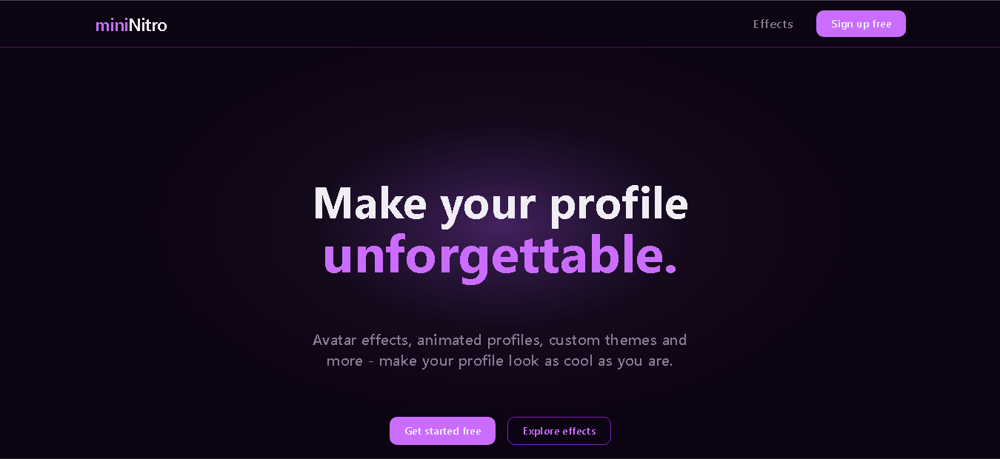
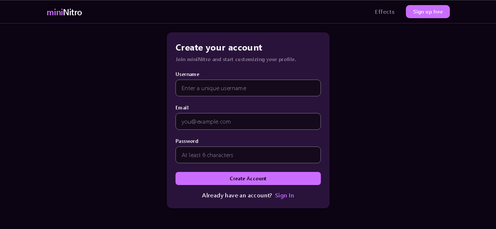
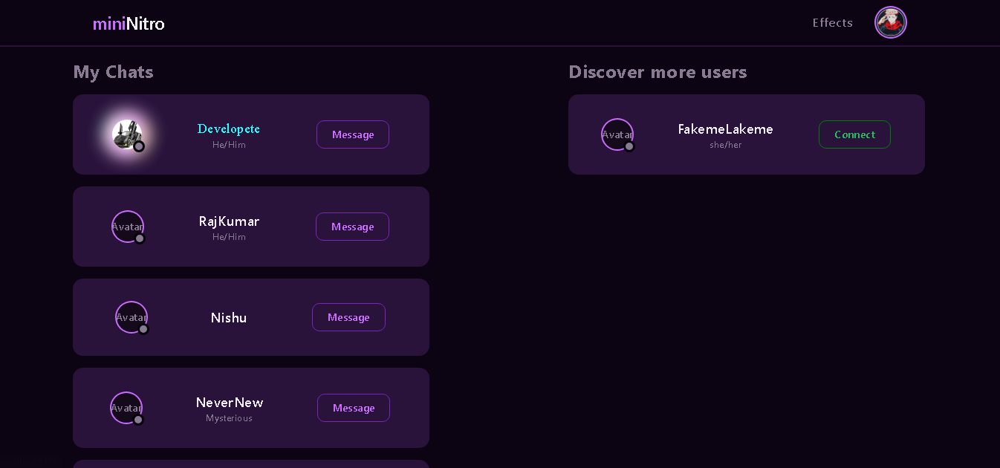
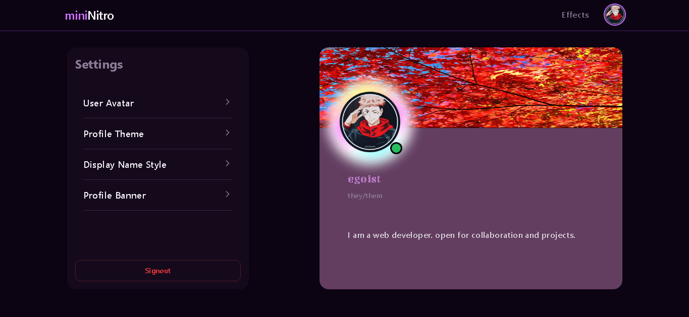
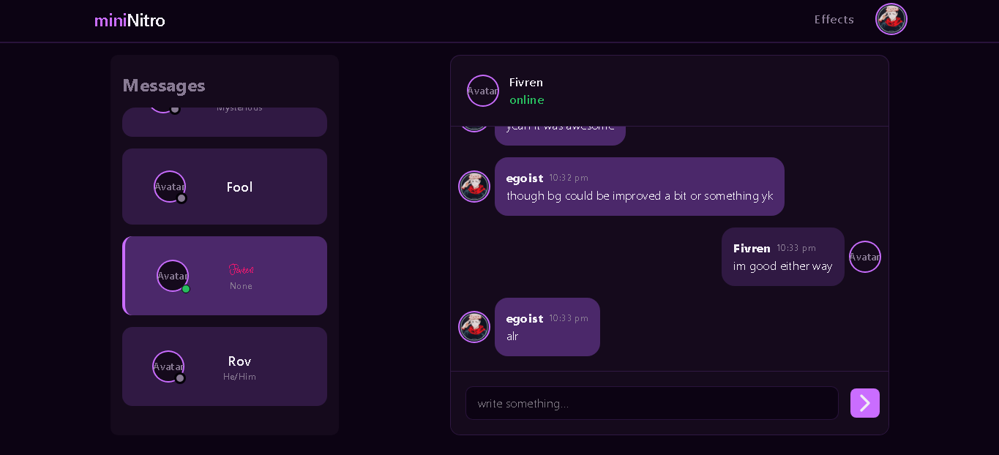
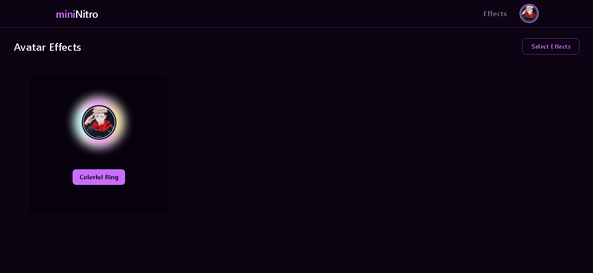

<div align="center">

# miniNitro

**Profile customization, reimagined.**

A full-stack MERN application inspired by Discord Nitro — built to explore premium-style visual effects, custom profile identity systems, and real-time communication in a scalable full-stack architecture.



[](https://nodejs.org)
[](https://react.dev)
[](https://mongodb.com)
[](https://expressjs.com)
[](https://socket.io)
[](https://tailwindcss.com)

</div>

---

## What is miniNitro?

miniNitro lets users build a fully customized profile identity — choose a theme color, upload a banner image, apply visual effects to their avatar, and style their display name with custom fonts. On top of that, users can discover other people on the platform and chat with them in real time.

The project is built as a product — not a tutorial clone — with a focus on real full-stack architecture, feature depth, and UI polish.

---

## Screenshots

| Page | Preview |
|---|---|
| **Landing page** |  |
| **Sign up** |  |
| **Home — For Logged In User** |  |
| **Profile & Settings** |  |
| **Real-time Chat** |  |
| **Avatar Effects** |  |

---

## Features

### Authentication
- JWT-based signup and login with protected routes
- Passwords hashed with bcrypt
- Auth state persisted via HTTP-only cookies

### Profile System
- Profile creation flow on first signup (display name, pronouns and bio)
- Avatar upload via Cloudinary with remove support
- Custom profile banner image
- Per-user theme color — full card background is user-controlled
- Display name font styling — choose from 10+ decorative fonts

### Visual Effects
- Three effect categories built into the system: **Avatar Effects**, **Nameplate Effects**, and **Profile Effects**
- Currently live: Colorful gradient glow ring (avatar)
- More effects coming soon across all three categories — the system is designed to be expandable, new effects plug in without structural changes

### Real-time Chat
- 1-on-1 messaging powered by Socket.io
- Online/offline status indicators
- Persistent message history via MongoDB
- Discover and connect with other users on the platform
- More features coming soon 

---

## Tech Stack

| Layer | Technology |
|---|---|
| **Frontend** | React (Vite), React Router, Tailwind CSS v4, shadcn/ui |
| **Backend** | Node.js, Express.js |
| **Database** | MongoDB with Mongoose |
| **Auth** | JWT + bcrypt |
| **Real-time** | Socket.io |
| **File storage** | Cloudinary (avatar + banner uploads) |
| **Styling system** | oklch color tokens, custom CSS @theme layer |

---

## Architecture Notes

- **Unified PATCH endpoints** — profile visuals (avatar, banner, theme) use conditional `$set`/`$unset` logic in a single endpoint rather than separate routes per field
- **Tailwind v4 + shadcn** — shadcn's CSS variables are explicitly bridged to a custom oklch-based `@theme` layer to avoid override conflicts
- **Cloudinary integration** — server-side upload via Multer → Cloudinary pipeline, with public_id tracking for clean deletion

---

## Local Setup

**Prerequisites:** Node.js, MongoDB (local or Atlas), Cloudinary account

```bash
# Clone the repo
git clone https://github.com/Saloni581/miniNitro.git

# Backend
cd server
npm install

# Frontend
cd ../client
npm install
```

Create a `.env` in `/server`:

```env
MONGO_URI=your_mongodb_connection_string
JWT_SECRET=your_jwt_secret
CLOUDINARY_CLOUD_NAME=your_cloud_name
CLOUDINARY_API_KEY=your_api_key
CLOUDINARY_API_SECRET=your_api_secret
PORT=3000
```

```bash
# Start backend
cd server && npm run dev

# Start frontend (separate terminal)
cd client && npm run dev
```

---

## Roadmap

- [ ] More avatar effects (particle systems, spinning borders, glow variants)
- [ ] Nameplate effects (animated nameplate in users list)
- [ ] Profile card effects (background animations)
- [ ] Edit profile (name, bio, pronouns) from settings
- [ ] Deployment (Railway + Vercel)

---

## Why I built this (actually continuosly building)

I wanted to build something that actually looked cool. Discord Nitro has these profile effects — glowing avatars, animated borders, custom themes — and I always thought they were the most fun part of the platform.
So I decided: what if I built that myself, from scratch, and actually understood
every line of it? miniNitro started as an excuse to learn real full-stack development by building
something I genuinely wanted to exist.

---

<div align="center">

Built with focus and excitement by Saloni Lathwariya 

</div>
